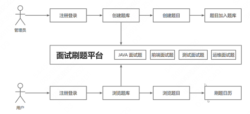
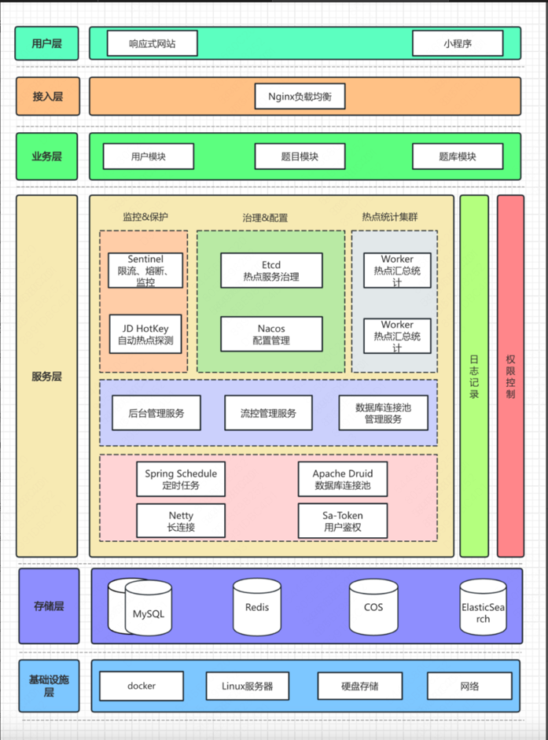

# 面试刷题平台 - 1.项目总览
### 一、项目介绍
面试鸭是一款基于Next.js + Srpingboot + Redis + Mysql + Elasticsearch的面试刷题平台, 运用Druid + Hotkey + Sa-Token + Sentinel提高了系统的性能和安全性

##### 核心业务流程



### 二、技术选型
##### 前端
- React框架
- Next.js服务端渲染 ⭐️
- Redux 状态管理 ⭐️
- Ant Design UI组件库
- 前端工程化: ESLint + Prettier + TypeScript ⭐️
- OpenAPI前端代码生成 ⭐️

##### 后端
- Java Spring Boot + Maven多模块构建 
- Mysql数据库 + MyBatis-Plus框架 + MyBatis X
- Redis分布式缓存 + Caffeine本地缓存
- Redission分布式锁 + Bitmap + BlomFilter
- Elasticsearch搜索引擎 ⭐️
- Druid数据库连接池 + 并发编程 ⭐
- Sa-Token 权限控制️ ⭐️
- Hotkey 热点探测 ⭐️
- Sentinel 流量控制 ⭐️
- Nacos 配置中心 ⭐️

### 三、架构设计



# 面试刷题平台 - 2.后端开发
### 项目功能梳理
##### 基础功能 (P0)
- 用户模块
- - 用户注册
- - 用户登陆
- - 【管理员】 管理用户-增删改查
- 题库模块
- - 查看题库列表
- - 查看题库详情(展示题库下的题目)
- - [管理员] 管理题库-增删改查
- 题目模块
- - 题目搜索
- - 查看题目详情
- - [管理员] 管理题目 - 增删改查

##### 高级功能 (P1-P2)
- 题目批量管理 P1
- - [管理员] 批量向题库中添加题目
- - [管理员] 批量从题库中移除题目
- - [管理员] 批量删除题目
- 分词题目搜索 P1
- 用户刷题记录日历图 P1
- 自动缓存热门题目 P2
- 网站流量控制和熔断 P2
- 动态IP黑白名单过滤 P2
- 同端登陆冲突检测 P2
- 分级题目反爬虫策略 P2

### 库表设计
对应需求分析中, 我们有4张核心表。
库名: mianshiya

##### 1.用户表
```sql
-- 用户表
create table if not exists user
(
    id           bigint auto_increment comment 'id' primary key,
    userAccount  varchar(256)                           not null comment '账号',
    userPassword varchar(512)                           not null comment '密码',
    unionId      varchar(256)                           null comment '微信开放平台id',
    mpOpenId     varchar(256)                           null comment '公众号openId',
    userName     varchar(256)                           null comment '用户昵称',
    userAvatar   varchar(1024)                          null comment '用户头像',
    userProfile  varchar(512)                           null comment '用户简介',
    userRole     varchar(256) default 'user'            not null comment '用户角色：user/admin/ban',
    editTime     datetime     default CURRENT_TIMESTAMP not null comment '编辑时间',
    createTime   datetime     default CURRENT_TIMESTAMP not null comment '创建时间',
    updateTime   datetime     default CURRENT_TIMESTAMP not null on update CURRENT_TIMESTAMP comment '更新时间',
    isDelete     tinyint      default 0                 not null comment '是否删除',
    index idx_unionId (unionId)
) comment '用户' collate = utf8mb4_unicode_ci;

```
unionId, mpOpenId是为了实现公众号登陆的(扫码登陆), 每个微信用户在同一家公司(主体)的unionId是唯一的, 在同一个公众号下的mpOpenId是唯一的。

##### 2.题库表
```sql
-- 题库表
create table if not exists question_bank
(
    id          bigint auto_increment comment 'id' primary key,
    title       varchar(256)                       null comment '标题',
    description text                               null comment '描述',
    picture     varchar(2048)                      null comment '图片url',
    userId      bigint                             not null comment '创建用户 id',
    editTime    datetime default CURRENT_TIMESTAMP not null comment '编辑时间',
    createTime  datetime default CURRENT_TIMESTAMP not null comment '创建时间',
    updateTime  datetime default CURRENT_TIMESTAMP not null on update CURRENT_TIMESTAMP comment '更新时间',
    isDelete    tinyint  default 0                 not null comment '是否删除',
    index idx_title (title)
) comment '题库' collate = utf8mb4_unicode_ci;

```
> text不是无限长度, 最长长度是65535个字符, 超过这个长度就会报错, 需要手动截断。如果text不够, 可以用

##### 3.题目表
```sql
-- 题目表
create table if not exists question
(
    id         bigint auto_increment comment 'id' primary key,
    title      varchar(256)                       null comment '标题',
    content    text                               null comment '内容',
    tags       varchar(1024)                      null comment '标签列表（json 数组）',
    answer     text                               null comment '推荐答案',
    userId     bigint                             not null comment '创建用户 id',
    editTime   datetime default CURRENT_TIMESTAMP not null comment '编辑时间',
    createTime datetime default CURRENT_TIMESTAMP not null comment '创建时间',
    updateTime datetime default CURRENT_TIMESTAMP not null on update CURRENT_TIMESTAMP comment '更新时间',
    isDelete   tinyint  default 0                 not null comment '是否删除',
    index idx_title (title),
    index idx_userId (userId)
) comment '题目' collate = utf8mb4_unicode_ci;

```

##### 4.题库题目关系表(题库题目为多对多关系)
由于一个题库可以有多个题目, 一个题目可以属于多个题库, 所以需要一张关系表来存储题库和题目的关系。

```sql
-- 题库题目表（硬删除）
create table if not exists question_bank_question
(
    id             bigint auto_increment comment 'id' primary key,
    questionBankId bigint                             not null comment '题库 id',
    questionId     bigint                             not null comment '题目 id',
    userId         bigint                             not null comment '创建用户 id',
    createTime     datetime default CURRENT_TIMESTAMP not null comment '创建时间',
    updateTime     datetime default CURRENT_TIMESTAMP not null on update CURRENT_TIMESTAMP comment '更新时间',
    UNIQUE (questionBankId, questionId)
) comment '题库题目' collate = utf8mb4_unicode_ci;

```

由于关联表中的数据记录没有那么重要, 所以直接采用硬删除的方式, 如果题目被移出题库, 直接删掉对应的数据即可。

> `UNIQUE (questionBankId, questionId)`, 这里创建了唯一索引, 并指定了questionBankId在前, 是因为业务场景中 经常是根据题库查询下面所有的题目, 这样设计更容易满足mysql索引的最左匹配原则

mysql索引:
- [mysql 索引](https://blog.csdn.net/weixin_74078718/article/details/132259392)
- [mysql之联合索引与最左匹配原则](https://blog.csdn.net/aiwangtingyun/article/details/134897381)
- [mysql的联合索引](https://blog.csdn.net/qq_37080455/article/details/139710370)

### 后端项目初始化
##### 后端万用模版


